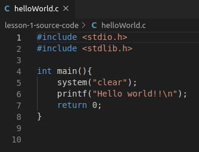

# C PROGRAMMING BAGI PEMULA

| [Home][0] | [Lesson 01][1] | [Lesson 02][2] | [Lesson 03][3] | [Lesson 04][4] | [Lesson 05][5] | [Develop Application][6] |
|:---------:|:--------------:|:--------------:|:--------------:|:--------------:|:--------------:|:------------------------:|

---

### LESSON 01: Pengenalan dasar tentang CLI Linux untuk develop aplikasi dengan menggunakan C GNU Library

---

### Objectives:
1. Peserta mampu menggunakan perintah dasar Linux. 
2. Peserta mampu mengenal Bahasa Pemrograman C.
3. Peserta mampu melakukan compile program C dengan menggunakan GNU C Library.
4. Peserta mampu menampilkan **Helo word** pada Bahasa Pemrograman C.
5. Persiapan untuk kelas berikutnya.

---

### Material
#### 1. Perintah Dasar Pada Linux

  * Penjelasan mengenai perintah **man**
    * **man**
      * Perintah yang digunakan untuk menampilkan usermanual dari perintah yang ada di linux.
    * Syntax
      * `man [LINUX COMMAND] <enter>`
    * Example
      * `man pwd`
      * `man cd`
      * `man ls`

  * Penjelasan mengenai perintah **pwd**
    * **pwd**
      * Perintah yang digunakan untuk mengetahui path direktori kerja Anda.
    * Syntax
      * `pwd <enter>`
    * Example
      * `pwd`

  * Penjelasan mengenai perintah **Is**
    * **Is**
      * Perintah yang digunakan untuk menampilkan daftar file dan direktori beserta metadata yang terkait dengan file dan folder tersebut diurutkannya berdasarkan abjad.
    * Syntax
      * `Is [OPTIONS] [PATH_DIRECTORY]<enter>`
    * Options yang sering digunakan
      * -a : tampilkan semua file dan folder (termasuk file yang disembunyikan dan root directori)
      * -l : tampilkan daftar list file dan folder format panjang ke bawah dengan meta data file dan folder.
      * -c : jika ditambahkan dengan **-lt** maka dapat menampilkan list file dan folder berdasarkan urutan dibuatnya file dan folder tersebut
      * -r : secara default list akan diurutkan dari abjad A sampai Z. Jika pake **-r** maka akan dibalik urutannya dari Z ke A.
    * Example
      * `ls`
      * `ls -a`
      * `ls -l`
      * `ls -al`
      * `ls -ltc`
      * `ls -alr`

  * Penjelasan mengenai perintah **cd**
    * **cd**
      * Perintah yang digunakan untuk mengubah direktori kerja Anda.
    * Syntax
      * `cd [PATH_DIRECTORY] <enter>`
    * Example
      * `cd /home`

  * Penjelasan mengenai perintah **touch**
    * **touch**
      * Perintah yang digunakan untuk stempel waktu pada sebuah file. Biasanya digunakan untuk stempel waktu file logger.
    * Syntax
      * `touch [OPTIONS] [PATH_FILE] <enter>`
    * Options yang sering digunakan
      * -c : secara default **touch** akan membuat file yang di **touch** jika file itu tidak ada, gunakan **-c** ini untuk mencegah file di create ketika file itu tidak ada.
    * Example
      * `touch -c logger.log`
      * `touch logger.log`

  * Penjelasan mengenai perintah **mkdir**
    * **mkdir**
      * Perintah yang digunakan untuk membuat sebuah direktori.
    * Syntax
      `mkdir [OPTIONS] [DIRECTORY_NAME] <enter>`
    * Options yang sering digunakan
      * -m : untuk mengatur file mode permission pada direktori yang akan dibuat.
      * -p : membuat parent direktori dari folder yang akan dibuat.
    * Example
      * `mkdir -m a=rwx mydir`
      * `mkdir -p parentFolder/childFolder`

  * Penjelasan mengenai perintah **rmdir**
    * **rmdir**
      * Perintah yang digunakan untuk menghapus direktori.
    * Syntax
      * `rmdir <enter>`
    * Options yang sering digunakan
      * -p : menghapus parent direktori dan child folder yang telah dibuat.
    * Example
      * `rmdir mydir`
      * `rmdir -p parentFolder/childFolder`

  * Penjelasan mengenai perintah **nano**
    * **nano**
      * Perintah yang digunakan untuk menampilkan editor text linux.
    * Syntax
      * `nano [NAMA_FILE] <enter>`
    * Catatan:
      * tekan Ctrl+O untuk menyimpan pengubahan pada file. Kemudian tekan enter ketika di bagian sisi kiri bawah ada tulisan "File Name to Write:", jika nama file penyimpanan konten sudah sesuai keinginan.
      * tekan Ctrl+X untuk keluar dari editor nano.
    * Example
      * Jalankan perintah `nano halo.txt`.
      * isi file **halo.txt** dengan ini:
      ```c
        Halo ini adalah isi dari sebuah file.
      ```
      * tekan Ctrl+O untuk menyimpan pengubahan pada file. Kemudian tekan enter ketika di bagian sisi kiri bawah ada tulisan "File Name to Write:", jika nama file penyimpanan konten sudah sesuai keinginan.
      * tekan Ctrl+X untuk keluar dari editor nano.

  * Penjelasan mengenai perintah **more**
    * **more**
      * Perintah yang digunakan untuk menampilkan isi dari sebuah file.
    * Syntax
      * `more [NAMA_FILE] <enter>`
    * Example
      * `more halo.txt`

  * Penjelasan mengenai perintah **cp**
    * **cp**
      * Perintah yang digunakan untuk meng-copy file atau folder.
    * Syntax
      * `cp [SOURCE] [DESTINATION] <enter>`
    * Example
      * `cp halo.txt halo_copy.txt`

  * Penjelasan mengenai perintah **mv**
    * **mv**
      * Perintah yang digunakan untuk memindahkan file atau folder.
    * Syntax
      * `mv [SOURCE] [DESTINATION] <enter>`
    * Example
      * `mv halo.txt ../halo_move.txt`

  * Penjelasan mengenai perintah **rm**
    * **rm**
      * Perintah yang digunakan untuk menghapus file.
    * Syntax
      * `rm [OPTIONS] [FILE_NAME|DIRECTORY_NAME] <enter>`
    * Options yang sering digunakan
      * -f : abaikan file yang tidak ada namun dipanggil saat di remove.
      * -r : hapus secara rekrusif.
    * Example
      * `rm halo_copy.txt`
      * `rm -rf parentFolder`

  * Penjelasan mengenai perintah **sudo**
    * **sudo**
      * Perintah yang digunakan untuk jalankan perintah sebagai pengguna lain.
    * Syntax
      * `sudo su` : login sebagai super user
      * `sudo /opt/lampp/lampp start` : jalankan xampp sebagai root

  * Penjelasan mengenai perintah **ps**
    * **ps**
      * Perintah yang digunakan untuk melihat status dari proses.
    * Syntax
      * `ps [OPTIONS] <enter>`
    * Options yang sering digunakan
      * -p : proses id dari program yang sedang dijalankan oleh.
      * -e : tampilkan semua proses.
      * -f : tampilkan dengan format list yang lengkap.
    * Example
      * `ps`
      * `ps -p 12344`
      * `ps -f`
      * `ps -e`
      * `ps -ef`

  * Penjelasan mengenai perintah **kill**
    * **kill**
      * Perintah yang digunakan untuk membunuh sebuah proses.
    * Syntax
      * `kill [SIGNAL] [PID]<enter>`
    * Signal yang sering digunakan
      * -9 : kill oleh kernel linux.
    * Example
      * `kill 12344`
      * `kill -9 12344`

  * Penjelasan mengenai perintah **grep**
    * **grep**
      * Perintah yang digunakan untuk mencari sesuatu menggunakan global regular expression.
    * Syntax
      * `grep [PATTERN] <enter>`
    * Example
      * `ps -e | grep "chrome"`
      * `more halo.txt | grep "halo"`

  * Penjelasan mengenai perintah **chmod**
    * **chmod**
      * Perintah yang digunakan untuk mengubah mode file.
    * Syntax
      * `chmod [MODE] [FILE]<enter>`
    * Mode [ABC]
      * A : permission mode untuk user
      * B : permission mode untuk group
      * C : permission mode untuk other
      * AB dan C bisa di isi dengan nilai di bawah ini:
        * 4 stands for "read",
        * 2 stands for "write",
        * 1 stands for "execute", and
        * 0 stands for "no permission."
    * Example
      * `chmod 467 halo.txt`
        
  * Penjelasan mengenai perintah **chown**
    * **chown**
      * Perintah yang digunakan untuk mengubah kepemilikan file.
    * Syntax
      * `chown [USER]:[GROUP] [NAMA_FILE]<enter>`
    * Example
      * `chown gcp:gcp halo.txt`

  * Penjelasan mengenai perintah **clear**
    * **clear**
      * Perintah yang digunakan untuk membersihkan output terminal.
    * Syntax
      * `clear <enter>`
  
  * Penjelasan mengenai perintah **reboot**
    * **reboot**
      * Perintah yang digunakan untuk me-reboot sistem.
    * Syntax
      * `reboot <enter>`

  * Penjelasan mengenai perintah **shotdown**
    * **shotdown**
      * Perintah yang digunakan untuk mematikan sistem.
    * Syntax
      * `shotdown <enter>`

#### 2. Pengenalan Bahasa Pemrograman C
  * Apa itu bahasa program C?
    * **Bahasa C** adalah bahasa pemrograman tingkat menengah. Artinya bahasa C ini lebih ringan dan kecil ukuran aplikasinya dibandingkan dengan bahasa tingkat tinggi dan sintak pemrogramannya pun lebih mudah dipahami dibandingkan dengan bahasa tingkat rendah.

  * Apa keuntungan belajar program C?
    Keuntungan dari belajar bahasa pemrograman C:
    - Hampir semua jenis komputer memahami bahasa pemrograman ini
    - Segala sesuatu dari mikrokontroler ke sistem operasi ditulis dalam pemrograman C.
    - Bahasa pemrograman C sangat fleksibel dan serbaguna, memungkinkan kontrol maksimum dengan perintah minimal.
    - Ukuran file aplikasi yang dibuat pemrograman C lebih kecil, ini dikarenakan bahasa prmrograman c adalah bahasa tingkat menengah sehingga tidak perlu terlalu banyak development kit yang di bundle bersama program.

  * Proses kompilasi program C?
    
    * Berikut ini penjelasan tahap-tahap pada gambar di atas:
      1. tahap preprosessor : membaca preprosessor yang ada di dalam program (#include <stdio.h>) dan memasukkan semua data yang terdapat dalam preprosessor kedalam kode program. hello.c disini kemudian menjadi hello.i
      2. tahap compiler: mengubah kode program hasil modifikasi dengan preprosessor menjadi kode dalam bahasa assembly. hello.i menjadi hello.s
      3. tahap assembler : mengubah kode bahasa assembly ke dalam kode biner (kode bahasa mesin). bentuknya berupa binary object program yang memiliki ekstensi .o .  hello.s menjadi hello.o
      4. tahap linking : menggabungkan hello.o dengan fungsi printf pada library C. hasilnya berupa file eksekusi yang siap disimpan di memory mesin atau dieksekusi oleh mesin.  

  * Struktur penulisan program C?
    <br>  

  * Pengenalan fungsi-fungsi dasar program C
    * Praprosesor **#include**
      * Di baris paling awal struktur penulisan program c, terdapat kode **#include**. Perintah **#include** digunakan untuk memasukkan sebuah file khusus yang memungkinkan kita mengakses berbagai fitur tambahan dalam bahasa C.
    * fungsi **main()**
      * Fungsi **main()** merupakan fungsi yang pertama kali akan dijalankan dan di eksekusi pada pemrograman C. Fungsi **main()** ini bisa memiliki tipe **int** dan **void**. Fungsi **main()** menggunakan tipe data **int**, jika setelah eksekusi program diperlukan nilai balik dari akhir eksekusi program, namun jika tidak memerlukan nilai balik, fungsi **main()** dapat menggunakan tipe data **void**.
    * fungsi **printf()**
      * Fungsi **printf()** berasal dari library stdio.h yang ditambahkan ke dalam kode program C. Fungsi ini digunakan untuk mencetak output pada program C.
    * fungsi **system()**
      * Fungsi **system()** berasal dari library stdlib.h yang ditambahkan ke dalam kode program C. Fungsi ini digunakan untuk menulis perintah CLI yang ingin di eksekusi di terminal melalui program C.

#### 3. Compile program C dengan menggunakan GNU C Library
  * Berikut ini adalah perintah yang digunakan untuk compile program C dengan program yang ditulis dalam 1 file source code:
    * Syntax
      * `gcc [NAMA FILE EXTENTION .c] -o [NAMA APLIKASI]`
    * Example
      * `gcc helloWorld.c -o helloWorld`

  * Berikut ini adalah perintah yang digunakan untuk compile program C dengan program yang ditulis lebih dari 1 file source code:
    * Syntax
      * `gcc [NAMA FILE SOURCE CODE 1 EXTENTION .c] -o [NAMA OBJEK FILE 1 EXTENTION .o] -c`
      * `gcc [NAMA FILE SOURCE CODE 2 EXTENTION .c] -o [NAMA OBJEK FILE 2 EXTENTION .o] -c`
      * `gcc -o [NAMA APLIKASI] [NAMA OBJEK FILE 1 EXTENTION .o] [NAMA OBJEK FILE 2 EXTENTION .o]`
    * Example
      * `gcc main.c -o main.o -c`
      * `gcc module.c -o module.o -c`    
      * `gcc -o myprog main.o module.o`

#### 4. Menjalankan program C C
 * Menjalankan program C tanpa ada parameter input
    * Syntax
      * `./[NAMA_APLIKASI]`
    * Example
      * `./helloWorld`
      * `./myprog` 
      
 * Menjalankan program C dengan parameter input
    * Selain menjalankan program tanpa parameter input, kita juga bisa membuat extensi program yang menerima parameter input. Gambar di bawah ini adalah contoh program c yang mana extensi program yang menerima parameter input.
    <br>
    * Pada fungsi **main()** terdapat dua parameter **argc** dan **argv[]**. **argc** berisikan jumlah parameter yang dimasukan ke terminal saat program dieksekusi. **argv[]** berisikan array data parameter yang dimasukan ke terminal saat program dieksekusi.
---

### File
  * [Source code](lesson-1-source-code/)

---

### Execises
1. Perintah Dasar Pada Linux
    * Buka terminal dan masuk ke dalam direktori Document dengan menggunakan perintah **cd**.
    * Buat sebuah folder pada direktori Document dengan nama CProgrammingClass menggunakan perintah **mkdir**.
    * Buat sebuah folder pada direktori CProgrammingClass dengan nama Lesson01 menggunakan perintah **mkdir**.
    * Buat tiga buah folder pada direktori Lesson01 dengan nama FolderA, FolderB, DeleteFolder menggunakan satu perintah **mkdir**.
    * Tampilkan isi dari folder Lesson01 dengan menggunakan perintah **ls** dengan format panjang ke bawah.
    * Hapus folder DeleteFolder dengan menggunakan perintah **rmdir**.
    * Buat sebuah file test.c pada direktori FolderA dengan menggunakan perintah **nano** isi dengan source code di bawah ini.

      ```c
      # include <stdio.h>
      int main()
      {
        printf("Ini adalah output dari perintah printf"); 
      }
      ```
    * Pindahkan file test.c ke dalam FolderB dengan menggunakan perintah **mv**.
    * Copy file test.c ke dalam FolderA dengan menggunakan perintah **cp**.
2. Salin kembali contoh program yang telah di berikan pada **lesson 1** ini dan modifikasi source code tersebut sesuai dengan keinginan dirimu.
---

### Feedback
1. Apa yang menjadi kendala dari **lesson 01** ini?
2. Apa yang sebaiknya ditambah dan ditiadakan dari materi **lesson 01** ini?

---

### References
1. [Linux and Unix commands](https://www.computerhope.com/unix.htm)
2. [ Referensi fungsi dan header yang ada di GNU C Library Standar IEEE ](https://pubs.opengroup.org/onlinepubs/9699919799/)

---

| [Home][0] | [Lesson 01][1] | [Lesson 02][2] | [Lesson 03][3] | [Lesson 04][4] | [Lesson 05][5] | [Develop Application][6] |
|:---------:|:--------------:|:--------------:|:--------------:|:--------------:|:--------------:|:------------------------:|

[0]: README.md "Home"
[1]: lesson-01.md "Pengenalan dasar tentang CLI Linux untuk develop aplikasi dengan menggunakan C GNU Library"
[2]: lesson-02.md "Pengenalan algoritma dasar pemrograman dengan Bahasa C"
[3]: lesson-03.md "Array dan struktur pada Pemrograman C"
[4]: lesson-04.md "Penanganan file pada Pemrograman C"
[5]: lesson-05.md "Implementasi TCP Server - Client pada Pemrograman C"
[6]: lesson-06.md "Pembuatan aplikasi Collect and Controlling Data Logger"
